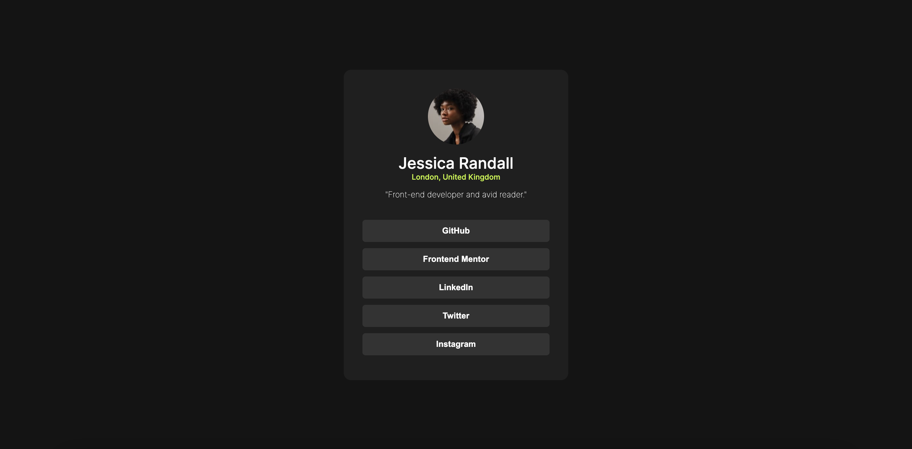

# Frontend Mentor - Social links profile Completed Project

## Project Overview

This project has been successfully completed, showcasing a social links profile page designed and implemented as per the Frontend Mentor challenge. 

## File Structure

- HTML content is located in `index.html`
- CSS styles are defined in `styles.css`

## Introduction

This project was developed as part of a Frontend Mentor challenge, aiming to replicate a design with a basic understanding of HTML and CSS. The challenge was to build out a social links profile page and achieve a design as close to the provided design as possible.

The completion of this project demonstrates the ability to translate a static design into a responsive webpage using modern HTML and CSS techniques.

## Usage

To view the project, open `index.html` in a web browser. Styles are applied from the `styles.css` file to match the design specification provided by Frontend Mentor.

## Acknowledgments

Special thanks to Frontend Mentor for providing this challenge. It served as a great opportunity to practice and enhance web development skills.

**Thank you for visiting this project!** 🚀
